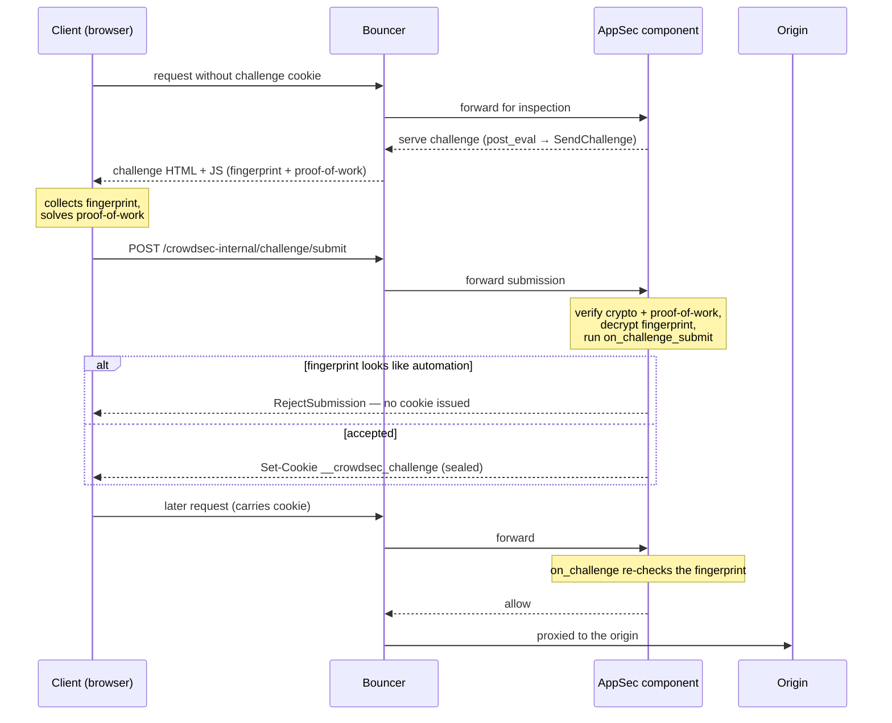

Bot detection interposes a **browser-side proof-of-work + device-fingerprint check** between a visitor and your application. A client that clears it receives a sealed cookie and is not challenged again until the cookie expires; a client that fails — or never tries — is filtered out.

Step by step:

1. A request with no valid `__crowdsec_challenge` cookie reaches a protected route, triggering `SendChallenge`.
2. Instead of the origin response, the AppSec component serves a challenge page that pulls in the JavaScript doing the work: the open-source [fpscanner](https://github.com/antoinevastel/fpscanner) **fingerprinting library** (served as-is, public code), a small **proof-of-work / crypto bundle**, and a **per-epoch signing-key module**. Only the last two are obfuscated — fpscanner is not — see [JS obfuscation](configuration.md#js-obfuscation).
3. The browser collects a device fingerprint and solves a proof-of-work puzzle (its cost is tunable with `SetChallengeDifficulty` — see [Challenge difficulty levels](hooks.md#challenge-difficulty-levels)), then POSTs the result to `/crowdsec-internal/challenge/submit`.
4. The AppSec component cryptographically validates the submission and decrypts the fingerprint. The client will be rejected if it identifies as automation, or let them through.
5. On acceptance, the client receives a **sealed success cookie** carrying the fingerprint and an expiry timestamp. Subsequent requests present the cookie and will pass — without re-challenging. A browser refusing cookies could never pass, so the challenge page detects it upfront and displays an explicit "Cookies are disabled" message.
6. Signing keys rotate on a schedule (`key_rotation_interval`), but the cookie is sealed under a separate long-lived key, so rotation does not invalidate already-issued cookies. A single `master_secret` roots every key and must be shared across instances in an HA deployment — see [Key management](configuration.md#key-management).
7. Legitimate non-browser clients (search crawlers, uptime probes, …) are recognised per request by the `appsec-bot-challenge-exclude-*` configs — which match them with `MatchKnownBot()` (IP-range or forward-confirmed reverse-DNS verified) and flag them with `ExemptFromChallenge(reason)` — and skipped, with no cookie minted. See [Known bots it lets through](whats_included.md#known-bots-it-lets-through).
8. Per-request hooks only see one request at a time. The [behavioral scenarios](whats_included.md#behavioral-scenarios-it-installs) shipped by the collection watch across requests (too many challenge requests, too many submissions) and create decisions that block repeat offenders at the bouncer.

:::note
The challenge runtime is built **lazily** — it only spins up if a loaded hook references `SendChallenge()`, `GrantChallengeCookie()`, or `RejectSubmission()`. Installing the [bot-detection collection](enable.md) is what turns it on.
:::

:::info Credits
Device fingerprinting is powered by [fpscanner](https://github.com/antoinevastel/fpscanner), an open-source library by Antoine Vastel.
:::

## What the challenge collects

When a browser runs the challenge, the open-source [fpscanner](https://github.com/antoinevastel/fpscanner) library (by Antoine Vastel) gathers a broad device fingerprint and posts it back (encrypted) with the proof-of-work. The AppSec component decrypts it into a `FingerprintData` object and derives the bot-detection verdict from it. The data points fall into a few families:

- **Automation** — webdriver / Selenium / CDP / Playwright indicators. Feeds `HasAutomationSignal()`.
- **Device** — CPU count, memory, platform, screen geometry, media devices, and CSS media queries. Implausible values (e.g. impossible core counts or memory) feed `HasImpossibleDeviceSignal()`.
- **Browser** — User-Agent, a browser-feature bitmask, installed plugins and extensions, and UA client-hints. Headless tells here feed `HasHeadlessSignal()`.
- **Graphics** — WebGL and WebGPU vendor/renderer, plus canvas fingerprint.
- **Codecs** — audio/video capability hashes.
- **Locale** — timezone and languages.
- **Cross-context checks** — the same signals re-read inside an iframe and a web worker; disagreement across contexts feeds `HasMismatchSignal()`.

The high-level `fingerprint.IsBot()` verdict is `true` when any of these signal families fires; the individual helpers let you branch on a specific class (see [Using the bot signal](customization.md#using-the-bot-signal-in-appsec-configs-and-scenarios)).

The exact set of collected data points is not fixed: because it tracks [fpscanner](https://github.com/antoinevastel/fpscanner), the fields and signals evolve as the library adds new detections and browsers change. Treat the list above as the current shape rather than a stable contract — for the exhaustive, always-current list of fields, see the exported Go type: [`FingerprintData`](https://pkg.go.dev/github.com/crowdsecurity/crowdsec/pkg/appsec/challenge#FingerprintData).
