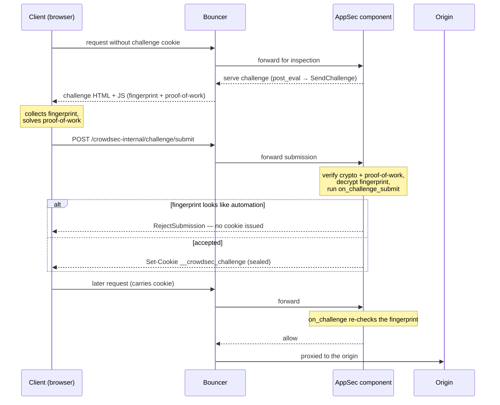

Bot detection allows you to block automation before it reaches the application. Where the rest of the WAF reacts to *what a user does* — the payloads they send, the endpoints they hit, the patterns they trigger — bot detection answers a different question: *what a user is*, a real browser or a script pretending to be one.

## What bot detection does

Bot detection separates humans from automation. Real browsers pass the check transparently and continue as usual; bots, headless browsers and clients that don't execute JavaScript are filtered out — by the AppSec component for the obvious cases, and by CrowdSec scenarios for the repeat offenders.

## How it works

Bot detection interposes a **browser-side proof-of-work + device-fingerprint check** between a visitor and your application. A client that clears it receives a sealed cookie and is not challenged again until the cookie expires; a client that fails — or never tries — is filtered out.

Step by step:

1. A request with no valid `__crowdsec_challenge` cookie reaches a protected route, triggering `SendChallenge`.
2. Instead of the origin response, the AppSec component serves a challenge page that pulls in the JavaScript doing the work: the open-source [fpscanner](https://github.com/antoinevastel/fpscanner) **fingerprinting library** (served as-is, public code), a small **proof-of-work / crypto bundle**, and a **per-epoch signing-key module**. Only the last two are obfuscated — fpscanner is not — see [JS obfuscation](configuration.md#js-obfuscation).
3. The browser collects a device fingerprint and solves a proof-of-work puzzle (its cost is tunable with `SetChallengeDifficulty` — see [Challenge difficulty levels](../hooks.md#challenge-difficulty-levels)), then POSTs the result to `/crowdsec-internal/challenge/submit`.
4. The AppSec component cryptographically validates the submission and decrypts the fingerprint. The client will be rejected if it identifies as automation, or let them through.
5. On acceptance, the client receives a **sealed success cookie** carrying the fingerprint and an expiry timestamp. Subsequent requests present the cookie and will pass — without re-challenging.
6. Signing keys rotate on a schedule (`key_rotation_interval`), but the cookie is sealed under a separate long-lived key, so rotation does not invalidate already-issued cookies. A single `master_secret` roots every key and must be shared across instances in an HA deployment — see [Key management](configuration.md#key-management).
7. Legitimate non-browser clients (search crawlers, uptime probes, …) are recognised per request by the `appsec-bot-challenge-exclude-*` configs — which match them with `MatchKnownBot()` (IP-range or forward-confirmed reverse-DNS verified) and flag them with `ExemptFromChallenge(reason)` — and skipped, with no cookie minted. See [Known bots it lets through](whats_included.md#known-bots-it-lets-through).
8. Per-request hooks only see one request at a time. The [behavioral scenarios](whats_included.md#behavioral-scenarios-it-installs) shipped by the collection watch across requests (too many challenge requests, too many submissions, never-submits) and create decisions that block repeat offenders at the bouncer.

:::note
The challenge runtime is built **lazily** — it only spins up if a loaded hook references `SendChallenge()`, `GrantChallengeCookie()`, or `RejectSubmission()`. Installing the [bot-detection collection](enable.md) is what turns it on.
:::

:::info Credits
Device fingerprinting is powered by [fpscanner](https://github.com/antoinevastel/fpscanner), an open-source library by Antoine Vastel.
:::

## Prerequisites

- A working AppSec setup. If you don't have one yet, follow the [general AppSec quickstart](../quickstart/general.mdx).
- A **compatible bouncer**. Bot detection requires the bouncer to forward the challenge endpoints to the AppSec component, so not every bouncer can serve it. The currently compatible ones (look for the **Bot Detection** badge at the top of their page) are:
  - [Nginx](/u/bouncers/nginx)
  - [HAProxy SPOA](/u/bouncers/haproxy_spoa)
  - [Traefik](/u/bouncers/traefik)

## Next steps

- [Enable bot detection](enable.md) — install the collection, wire the acquisition, and verify it.
- [What the collection ships](whats_included.md) — the appsec-config, known-bot handling, and behavioral scenarios you just enabled.
- [Customization & recipes](customization.md) — narrow the challenge to a path, allowlist a probe, and react to the bot signal in your own scenarios.
- [Configuration](configuration.md) — master secret, key rotation, cookie TTL, and JS obfuscation.
- [Hooks reference](../hooks.md) — full list of helpers and the `on_challenge` / `on_challenge_submit` stages.
