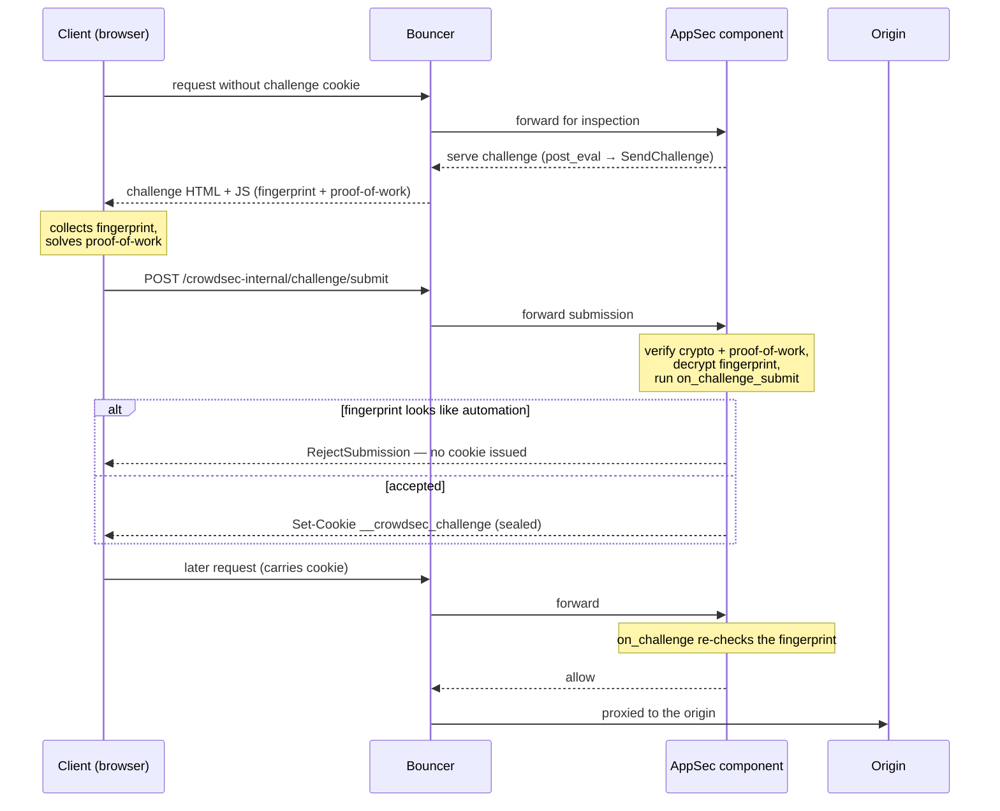

This page describes what is inside the [`crowdsecurity/appsec-bot-challenge`](https://app.crowdsec.net/hub/author/crowdsecurity/collections/appsec-bot-challenge) collection, so you know what behavior [installing it](enable.md) enables. None of it requires an extra install step.

## The appsec-config it installs

The collection ships `crowdsecurity/appsec-bot-challenge-simple`, the appsec-config that turns the challenge on:

```yaml
name: crowdsecurity/appsec-bot-challenge-simple
inband:
  post_eval:
    # Challenge every request. Verified bots and well-known paths are flagged by
    # the exclude-configs' pre_eval hooks and skipped by SendChallenge itself.
    - filter: "true"
      apply:
        - SendChallenge()
  on_challenge_submit:
    # Reject submissions whose fingerprint trips the fast bot detection.
    - filter: "fingerprint.IsBot()"
      apply:
        - RejectSubmission("known bot (fast bot detection)")
```

## Bad bots it rejects

The shipped `appsec-bot-challenge-simple` config includes a hook that rejects submission when the in-browser fast-bot-detection library has flagged the client (headless browser, automation framework, impossible device profile, ...):

```yaml
on_challenge_submit:
  - filter: "fingerprint.IsBot()"
    apply:
      - RejectSubmission("known bot (fast bot detection)")
```

A rejected submission produces both a log line and a CrowdSec event, meaning it shows up as an **alert in the CrowdSec console** (and in `cscli alerts list`) alongside the rest of your detection signals:

```
time="2026-06-03T13:57:49Z" level=info msg="on_challenge_submit rejected" automation=true bouncer=127.0.0.1 component=appsec_runtime_config fsid=FS1_000010000000000000000_00010h02ba_1920x1080c16m32b10011h22f04c_f1000111100010111100011111111e00000000p1100h793814_0h005997_1h-53968_en1tEurope-Paris_h-626_0100h3f9247 is_bot=true module=acquisition.appsec name="127.0.0.1:7422/" platform=Linux reason="Fast Bot Detection" request_uuid=9a822e6b-e20f-465c-8a52-b39ed62e7b7a signals="[cdp]" source=X.X.X.X type=appsec ua="Mozilla/5.0 (X11; Linux x86_64) AppleWebKit/537.36 (KHTML, like Gecko) Chrome/148.0.0.0 Safari/537.36"
```

Accepted submissions get a matching `challenge submission accepted` line for the clients that pass — see the [Verification](enable.md#verification) section for what to expect in the log.


## Behavioral scenarios it installs

Per-request hooks can only see the request in front of them. The collection therefore also installs four CrowdSec scenarios that watch the bigger picture — one alerts, the other three create decisions (i.e. blocks at the bouncer level) for repeat offenders:

| Scenario | Type | What it catches | Outcome |
|---|---|---|---|
| `crowdsecurity/appsec-bot-detected` | trigger | A known bot was detected and rejected by the challenge (a `rejected` event). | Alert only |
| `crowdsecurity/appsec-bot-challenge-too-many-requests` | leaky | An IP is served the challenge page repeatedly but never submits it. | Block |
| `crowdsecurity/appsec-bot-challenge-too-many-submissions` | leaky | An IP submits the challenge many times — typical of an automated solver or a script brute-forcing the fingerprint. | Block |
| `crowdsecurity/appsec-bot-challenge-request-with-no-submission` | counter | An IP requests the challenge page but never POSTs to `/submit` — typical of scripts that don't execute JavaScript. | Block |

These are regular scenarios, so they show up in `cscli alerts list`, in the console, and in your decision stream as you'd expect. The collection also ships the `crowdsecurity/appsec-bot-detection` alert context, which attaches the fingerprint id (`fsid`), operating system, User-Agent, the bot verdict, and the list of detected signals to those alerts.

## Known bots it lets through

Some non-browser clients are legitimate and must not be challenged (search-engine crawlers, uptime probes, AI crawlers, and the like). The collection recognises them and skips the challenge for them.

The exemptions are shipped as opt-in `appsec-bot-challenge-exclude-*` appsec-configs. Each one runs a hook that matches a verified bot with `MatchKnownBot()` and flags it with `ExemptFromChallenge(reason)`; For example, the AI-crawler exclude-config:

```yaml
inband:
  pre_eval:
    - filter: MatchKnownBot(req.RemoteAddr, req.UserAgent(), req.URL.Path, "legit_bots/gptbot.json")
      apply:
        - ExemptFromChallenge("gptbot")
```

`MatchKnownBot()` checks the client IP against the vendor's published ranges and/or a forward-confirmed reverse-DNS lookup (FCrDNS); a bot is exempted **only** when it can be network-verified. A spoofed UA on an IP that does not belong to the vendor is **not** recognised and goes through the normal challenge flow. The bot definitions live in [bot-description files](#authoring-your-own-known-bot-files) that each exclude-config declares in its own `data:` section (see below).

:::note
`ExemptFromChallenge(reason)` exempts the **current request only**, it does not issue a cookie.
:::

The built-in bot families are split across four identity exclude-configs, so you can install only the ones you need:

| Appsec-config | Bots it verifies |
|---|---|
| `crowdsecurity/appsec-bot-challenge-exclude-search-engines` | googlebot, bingbot, applebot, amazonbot, yandex, baidu, yahoo, sogou, qwant, babbar, duckduckbot |
| `crowdsecurity/appsec-bot-challenge-exclude-ai-crawlers` | gptbot, openai-searchbot, openai-chatgpt-user, perplexitybot |
| `crowdsecurity/appsec-bot-challenge-exclude-social` | meta, discord, telegram, twitterbot, pinterest |
| `crowdsecurity/appsec-bot-challenge-exclude-monitoring` | uptimerobot, cookiebot, datadog, pagerduty |

Each config declares the datafiles CrowdSec should download into `<datadir>/legit_bots/` in its `data:` section, and `MatchKnownBot()` reads them at match time.

### Authoring your own known-bot files

`MatchKnownBot()` matches a request against the bot-description files you name, under `<datadir>/legit_bots/` (typically `/var/lib/crowdsec/data/legit_bots/`). The exclude-configs above keep the built-in definitions up to date; to recognise a bot of your own, ship a custom appsec-config that both calls `MatchKnownBot(..., "legit_bots/mybot.json")` and declares that file in its `data:` section:

```yaml
inband:
  pre_eval:
    - filter: MatchKnownBot(req.RemoteAddr, req.UserAgent(), req.URL.Path, "legit_bots/mybot.json")
      apply:
        - ExemptFromChallenge("mybot")
data:
  - source_url: https://example.com/mybot.json
    dest_file: legit_bots/mybot.json
    type: bots
```

Each file is one or more newline-delimited JSON objects with these fields:

| Field        | Type        | Required | Meaning                                                                                                  |
| ------------ | ----------- | -------- | ------------------------------------------------------------------------------------------------------- |
| `name`       | string      | yes      | Identifier for the bot, used in logs.                                                                    |
| `user_agent` | string      | no       | Case-insensitive regex the request User-Agent must match.                                                |
| `paths`      | `[]string`  | no       | Regexes; the request path must match at least one if present.                                            |
| `ips`        | `[]string`  | no\*     | Exact source IPs (IPv4 or IPv6).                                                                         |
| `ranges`     | `[]string`  | no\*     | Source CIDR ranges.                                                                                      |
| `rdns`       | `[]string`  | no\*     | Regexes matched against the **forward-confirmed** reverse-DNS name of the source IP. Anchor them (e.g. `\\.googlebot\\.com$`) to avoid false positives. |

\* At least one of `ips`, `ranges`, or `rdns` is required — a definition that only matches on `user_agent` is rejected at load time, since a User-Agent alone is trivial to spoof.

A request is recognised as a known bot when:

```
(user_agent matches  AND  at least one path matches)  AND  (exact IP  OR  CIDR range  OR  FCrDNS)
```

The helper is **fail-closed**: an unparseable address, a DNS failure, or an unknown file means "not a known bot", never an error, so the request falls through to the normal challenge.

Example file:

```json
{"name":"googlebot","user_agent":"googlebot","rdns":["(^|\\.)googlebot\\.com$","\\.google\\.com$"]}
{"name":"uptimerobot","user_agent":"uptimerobot","paths":["^/health(/|$)","^/status$"],"ranges":["69.162.124.224/28"],"ips":["216.144.250.150"]}
{"name":"internal-scanner","ips":["10.1.2.3","2001:db8::42"]}
```

The reverse-DNS confirmation used by `rdns` goes through the engine's DNS cache; see [DNS cache](configuration.md#dns-cache) if you need to tune its TTL or size.

## Path-exclusion configs

The `appsec-bot-challenge-exclude-*` family has two kinds of members: the identity exclude-configs above (which match verified bots with `MatchKnownBot`), and the path exclude-configs described here (which match on the request path). Both flag the request with `ExemptFromChallenge(reason)`.

Some routes are hit by design by clients that will never solve a challenge — crawler metadata files, syndication feeds, third-party webhooks, static assets, and programmatic API endpoints. Challenging them just produces false positives. The collection ships five opt-in path exclude-configs whose `pre_eval` calls `ExemptFromChallenge(reason)` for those paths (exempting the single request, no cookie minted):

| Appsec-config | Exempts |
|---|---|
| `crowdsecurity/appsec-bot-challenge-exclude-crawler-files` | `/robots.txt`, `/.well-known/*`, `/security.txt`, `/sitemap.xml`, `/ads.txt`, … |
| `crowdsecurity/appsec-bot-challenge-exclude-feeds` | RSS/Atom feed paths (`/feed`, `/rss`, `/atom.xml`, …) |
| `crowdsecurity/appsec-bot-challenge-exclude-webhooks` | `/webhooks/*` |
| `crowdsecurity/appsec-bot-challenge-exclude-static` | static assets and media (`.css`, `.js`, images, fonts, `/manifest.json`, …) |
| `crowdsecurity/appsec-bot-challenge-exclude-api` | programmatic endpoints (`/api/*`, `/graphql`, `/wp-json/*`, `/oauth/*`, …) |

They are separate configs so you can drop any that don't apply to your app — but keeping them on is the recommended default for fewer false positives. [Enable bot detection](enable.md#install-the-collection) shows how to load them from your acquisition. To add your own exclusions, ship a custom appsec-config rather than editing these.

## How it works

Bot detection interposes a **browser-side proof-of-work + device-fingerprint check** between a visitor and your application. A client that clears it receives a sealed cookie and is not challenged again until the cookie expires; a client that fails — or never tries — is filtered out.



Step by step:

1. A request with no valid `__crowdsec_challenge` cookie reaches a protected route, triggering `SendChallenge`.
2. Instead of the origin response, the AppSec component serves a challenge page that pulls in the JavaScript doing the work: the open-source [fpscanner](https://github.com/antoinevastel/fpscanner) **fingerprinting library** (served as-is, public code), a small **proof-of-work / crypto bundle**, and a **per-epoch signing-key module**. Only the last two are obfuscated — fpscanner is not — see [JS obfuscation](configuration.md#js-obfuscation).
3. The browser collects a device fingerprint and solves a proof-of-work puzzle (its cost is tunable with `SetChallengeDifficulty` — see [Challenge difficulty levels](../hooks.md#challenge-difficulty-levels)), then POSTs the result to `/crowdsec-internal/challenge/submit`.
4. The AppSec component cryptographically validates the submission and decrypts the fingerprint. The client will be rejected if it identifies as automation, or let them through.
5. On acceptance, the client receives a **sealed success cookie** carrying the fingerprint and an expiry timestamp. Subsequent requests present the cookie and will pass — without re-challenging.
6. Signing keys rotate on a schedule (`key_rotation_interval`), but the cookie is sealed under a separate long-lived key, so rotation does not invalidate already-issued cookies. A single `master_secret` roots every key and must be shared across instances in an HA deployment — see [Key management](configuration.md#key-management).
7. Legitimate non-browser clients (search crawlers, uptime probes, …) are recognised per request by the `appsec-bot-challenge-exclude-*` configs — which match them with `MatchKnownBot()` (IP-range or forward-confirmed reverse-DNS verified) and flag them with `ExemptFromChallenge(reason)` — and skipped, with no cookie minted. See [Known bots it lets through](#known-bots-it-lets-through).
8. Per-request hooks only see one request at a time. The [behavioral scenarios](#behavioral-scenarios-it-installs) shipped by the collection watch across requests (too many challenge requests, too many submissions, never-submits) and create decisions that block repeat offenders at the bouncer.

:::note
The challenge runtime is built **lazily** — it only spins up if a loaded hook references `SendChallenge()`, `GrantChallengeCookie()`, or `RejectSubmission()`. Installing the [bot-detection collection](enable.md) is what turns it on.
:::

:::info Credits
Device fingerprinting is powered by [fpscanner](https://github.com/antoinevastel/fpscanner), an open-source library by Antoine Vastel.
:::
