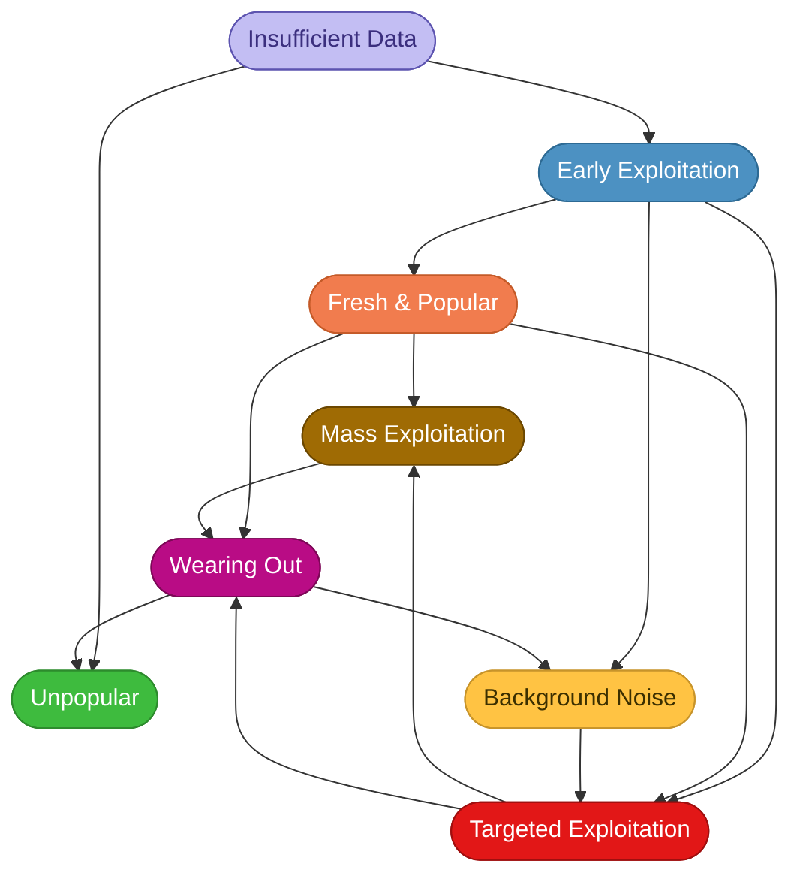

## Overview

Every tracked CVE and fingerprint rule is assigned an **exploitation phase** that describes where it sits in its lifecycle. While the [scores](./scores) give you numerical ratings, the exploitation phase gives you a qualitative label that's immediately understandable in conversations, reports, and dashboards.

The phases are determined by analyzing exploitation telemetry from the CrowdSec Network over time — they reflect real attacker behavior, not theoretical risk.

## The Phases

### Insufficient Data

> *"Not enough CrowdSec telemetry data is available to confidently assess how this vulnerability is exploited in the wild."*

This is the starting state for newly tracked CVEs or those affecting products with limited representation in the CrowdSec Network. It does **not** mean the CVE isn't being exploited — only that CrowdSec doesn't have enough observations to characterize the exploitation pattern with confidence.

**What to do**: Fall back to traditional risk indicators (CVSS score, public exploit availability, vendor advisory severity) until CrowdSec telemetry matures for this CVE. Check back periodically as the phase will update when sufficient data is collected.

### Early Exploitation

> *"Early exploitation attempts have been observed, but activity remains limited and not yet widespread."*

CrowdSec is picking up the first real signals — scan traffic or small-scale exploit attempts. It's not yet a campaign. This phase often appears in the days after a public PoC drops for a CVE that hasn't been widely weaponized yet.

**What to do**: Begin prioritizing this CVE for patching. The window between Early Exploitation and a broader campaign can be short — track momentum closely and reassess frequently.

### Fresh and Popular

> *"The vulnerability is recent and currently shows strong attacker interest with rapidly increasing exploitation activity."*

This CVE is gaining rapid traction in the attacker community. Volume is growing fast and multiple actors are experimenting with it. It may be on the verge of tipping into Mass Exploitation.

**What to do**: Treat this as high urgency. Patch immediately if possible. Deploy blocklists proactively — don't wait for confirmed hits on your infrastructure.

### Unpopular

> *"The vulnerability is known but shows very limited attacker interest or exploitation activity."*

CrowdSec has data for this CVE but observes minimal exploitation. Attackers are either unaware of it, unable to exploit it at scale, or have moved on to more productive targets.

**What to do**: Patch within your standard maintenance cycle. This is low on the priority list unless your specific environment makes it unusually exploitable.

### Background Noise

> *"Continuous low-level scanning or exploitation attempts are observed, mostly opportunistic and automated."*

This is the "internet weather" phase. The CVE is being hit by automated scanners and botnets as part of broad, indiscriminate campaigns. It's persistent but generally not dangerous to well-maintained infrastructure.

Think of it like port-scanning on port 22: it happens constantly, to everyone, and by itself it's not cause for alarm.

**What to do**: Ensure patches are applied. Consider blocklists if you want to reduce noise in your logs. Individual alerts are low-signal — don't let them dominate your SOC's attention.

### Targeted Exploitation

> *"Exploitation is observed against specific targets or environments, suggesting focused and intentional attack campaigns."*

This is where things get serious. Attackers are performing reconnaissance, selecting targets based on exposure and configuration, and launching deliberate campaigns. An alert for a CVE in this phase is much more likely to represent a real attack on your organization.

**What to do**: Prioritize patching urgently. Deploy blocklists via firewall integrations. If you see alerts on your infrastructure for CVEs in this phase, investigate them as potential incidents — not just noise.

### Mass Exploitation

> *"The vulnerability is actively exploited at scale across the internet, often via automated tools and large attack campaigns."*

The vulnerability has been weaponized at scale. Multiple threat actor groups are exploiting it, exploit code is widely available, and attack volume is high. This typically happens with high-impact vulnerabilities in widely deployed software.

**What to do**: Treat this as an emergency if you haven't patched yet. Verify patch status across your entire estate. Deploy blocklists immediately. Monitor for signs of compromise, as exploitation may have occurred before you acted.

### Wearing Out

> *"Exploitation activity is decreasing over time, likely due to patch adoption or reduced attacker interest."*

The peak campaign has passed. Patch adoption is reducing the attack surface and/or attackers have moved on. Activity is still present but on a clear downward trend.

**What to do**: If you haven't patched yet, do it now while the pressure is lower. This phase is a second chance — exploitation is easier to attribute and less noisy than at peak.

## Phase Transitions

CVEs don't always move linearly through these phases. Common patterns include:

- **New PoC drops**: A CVE moves from *Insufficient Data* to *Early Exploitation* within days of a public proof-of-concept being published.
- **Rapid weaponization**: *Early Exploitation* escalates to *Fresh and Popular* when multiple threat actors adopt the CVE simultaneously.
- **Fresh and Popular → Mass Exploitation**: The most common escalation path for high-impact CVEs in widely deployed software when no effective mitigation is available.
- **Fresh and Popular → Wearing Out**: Some CVEs peak quickly and decline before ever reaching mass scale — the community patches fast or the target surface is limited.
- **Old CVE with new exploit toolkit**: A CVE in *Background Noise* for years can escalate to *Targeted Exploitation* or *Mass Exploitation* when added to a popular exploit framework.
- **Campaign ends → Wearing Out**: After a *Mass Exploitation* or *Targeted Exploitation* campaign concludes, activity enters a decline.
- **Wearing Out → Background Noise**: Residual automated scanning typically continues long-term, settling into steady-state low-level activity.

## Phases and Scores Together

The exploitation phase and numerical scores provide **complementary but independent** signals. Phases are determined by analyzing exploitation patterns over time, while scores reflect the current snapshot. This means a CVE can have a high CrowdSec Score while still in the Insufficient Data phase (for example, a newly tracked CVE with intense but recent activity that hasn't been observed long enough to classify).

:::caution
Do not assume phases predict score ranges. A Background Noise CVE can have a CrowdSec Score of 6 if it has surging volume (high Momentum), while a Mass Exploitation CVE can have a score of 3 if the campaign is winding down. Use both signals together for a complete picture.
:::

Typical ranges observed in practice:

| Phase | Typical CrowdSec Score | Typical Opportunity Score | Typical Momentum Score |
|-------|----------------------|--------------------------|----------------------|
| Insufficient Data | 0–9 | 0–5 | 0–5 |
| Early Exploitation | 2–6 | 1–3 | 2–5 |
| Fresh and Popular | 5–9 | 2–4 | 4–5 |
| Unpopular | 1–7 | 1–2 | 0–5 |
| Background Noise | 1–6 | 1–2 | 0–5 |
| Targeted Exploitation | 7–8 | 4–5 | 2–4 |
| Mass Exploitation | 3–7 | 1–5 | 0–4 |
| Wearing Out | 1–5 | 1–3 | 0–2 |

Targeted Exploitation is the most predictable: it consistently shows high Opportunity scores (4–5) and elevated CrowdSec Scores. Fresh and Popular stands out for its high Momentum (4–5), reflecting the rapid growth in activity. Wearing Out is characterized by low and falling Momentum. Other phases are more loosely correlated — Background Noise and Unpopular overlap significantly in score ranges.
