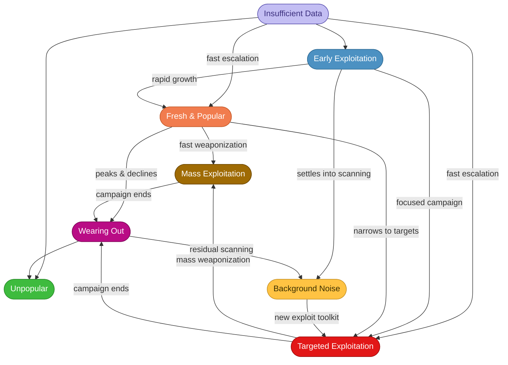

## Overview

Every tracked CVE and fingerprint rule is assigned an **exploitation phase** that describes where it sits in its lifecycle. While the [scores](./scores) give you numerical ratings, the exploitation phase gives you a qualitative label that's immediately understandable in conversations, reports, and dashboards.

The phases are determined by analyzing exploitation telemetry from the CrowdSec Network over time — they reflect real attacker behavior, not theoretical risk.

## The Phases

### Insufficient Data

> *"Not enough CrowdSec telemetry data is available to confidently assess how this vulnerability is exploited in the wild."*

This is the starting state for newly tracked CVEs or those affecting products with limited representation in the CrowdSec Network. It does **not** mean the CVE isn't being exploited — only that CrowdSec doesn't have enough observations to characterize the exploitation pattern with confidence.

**What to do**: Fall back to traditional risk indicators (CVSS score, public exploit availability, vendor advisory severity) until CrowdSec telemetry matures for this CVE. Check back periodically as the phase will update when sufficient data is collected.

### Early Exploitation

> *"Early exploitation attempts have been observed, but activity remains limited and not yet widespread."*

CrowdSec is picking up the first real signals — scan traffic or small-scale exploit attempts. It's not yet a campaign. This phase often appears in the days after a public PoC drops for a CVE that hasn't been widely weaponized yet.

**What to do**: Begin prioritizing this CVE for patching. The window between Early Exploitation and a broader campaign can be short — track momentum closely and reassess frequently.

### Rapid Escalation

> *"The vulnerability is recent and currently shows strong attacker interest with rapidly increasing exploitation activity."*

This CVE is recent and gaining rapid traction in the attacker community. Volume is growing fast and multiple actors are experimenting with it.

**What to do**: Treat this as high urgency. Patch immediately if possible. Deploy blocklists proactively — don't wait for confirmed hits on your infrastructure.

### Limited Exploitation

> *"The vulnerability is known but shows very limited attacker interest or exploitation activity."*

CrowdSec has data for this CVE but observes minimal exploitation. Attackers are either unaware of it, unable to exploit it at scale, or have moved on to more productive targets.

**What to do**: Patch within your standard maintenance cycle. This is low on the priority list unless your specific environment makes it unusually exploitable.

### Background Noise

> *"Continuous low-level scanning or exploitation attempts are observed, mostly opportunistic and automated."*

This is the "internet weather" phase. The CVE keeps being exploited by automated scanners and botnets as part of broad, indiscriminate campaigns. It's persistent but generally not dangerous to well-maintained infrastructure.

Think of it like port-scanning on port 22: it happens constantly, to everyone, and by itself it's not cause for alarm.

**What to do**: Ensure patches are applied. Consider blocklists if you want to reduce noise in your logs. Individual alerts are low-signal — don't let them dominate your SOC's attention.

### Active Exploitation

> *"The vulnerability is actively exploited at scale across the internet, often via automated tools and large attack campaigns."*

The vulnerability has been weaponized at scale. Multiple threat actor groups are exploiting it, exploit code is widely available, and attack volume is high. This typically happens with high-impact vulnerabilities in widely deployed software.

**What to do**: Treat this as an emergency if you haven't patched yet. Verify patch status across your entire estate. Deploy blocklists immediately. Monitor for signs of compromise, as exploitation may have occurred before you acted.

## Phase Transitions

The phase transitions for a CVE follow some business logic, that are represented in the Directed Graph below

```mermaid
graph TB
    ID(["Insufficient Data"]):::gray
    EE(["Early Exploitation"]):::early
    FP(["Fresh & Popular"]):::fresh
    UP(["Unpopular"]):::green
    BN(["Background Noise"]):::blue
    TE(["Targeted Exploitation"]):::orange
    ME(["Mass Exploitation"]):::red
    WO(["Wearing Out"]):::fading

    ID --> EE
    ID --> UP
    ID -->|fast escalation| FP
    ID -->|fast escalation| TE
    EE -->|rapid growth| FP
    EE -->|focused campaign| TE
    EE -->|settles into scanning| BN
    FP -->|fast weaponization| ME
    FP -->|narrows to targets| TE
    FP -->|peaks & declines| WO
    TE -->|mass weaponization| ME
    TE -->|campaign ends| WO
    ME -->|campaign ends| WO
    WO -->|residual scanning| BN
    WO --> UP
    BN -->|new exploit toolkit| TE

    classDef gray   fill:#C3BEF3,stroke:#5D54B0,color:#3b2f7e
    classDef early  fill:#4C91C2,stroke:#2d6a94,color:#fff
    classDef fresh  fill:#F17C4E,stroke:#c45a28,color:#fff
    classDef green  fill:#3EBB3E,stroke:#2d8b2d,color:#fff
    classDef blue   fill:#FFC343,stroke:#c8942a,color:#3b2f00
    classDef orange fill:#E21717,stroke:#a00f0f,color:#fff
    classDef red    fill:#9F6B04,stroke:#6b4700,color:#fff
    classDef fading fill:#B90C85,stroke:#7d0857,color:#fff
```
Notes that all the states will not necessarily be visited, and that a CVE can have different transitions order depending on its exploitation lifecycle.
A common transition path for a recently released CVE could be :

* insufficient_data : d+1
* early_exploitation : d+3
* rapid_esalation : d+7
* active_exploitation : d+30
* background_noise: d+180

## Phases and Scores Together

The exploitation phase and numerical scores provide **complementary but independent** signals. Phases are determined by analyzing exploitation patterns over time, while scores reflect the current snapshot. This means a CVE can have a high CrowdSec Score while still in the Insufficient Data phase (for example, a newly tracked CVE with intense but recent activity that hasn't been observed long enough to classify).

:::caution
Do not assume phases predict score ranges. A Background Noise CVE can have a CrowdSec Score of 6 if it has surging volume (high Momentum), while a Mass Exploitation CVE can have a score of 3 if the campaign is winding down. Use both signals together for a complete picture.
:::

Typical ranges observed in practice:

| Phase | Typical CrowdSec Score | Typical Opportunity Score | Typical Momentum Score |
|-------|----------------------|--------------------------|----------------------|
| Insufficient Data | 0–9 | 0–5 | 0–5 |
| Early Exploitation | 2–6 | 1–3 | 2–5 |
| Rapid Escalation | 5–9 | 2–4 | 4–5 |
| Limited Exploitation | 1–7 | 1–2 | 0–5 |
| Background Noise | 1–6 | 1–2 | 0–5 |
| Active Exploitation | 3–7 | 1–5 | 0–4 |

