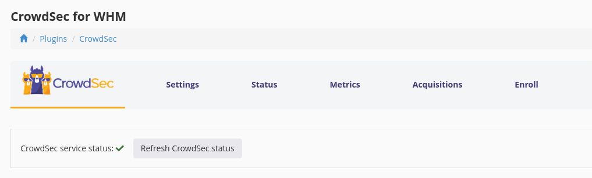
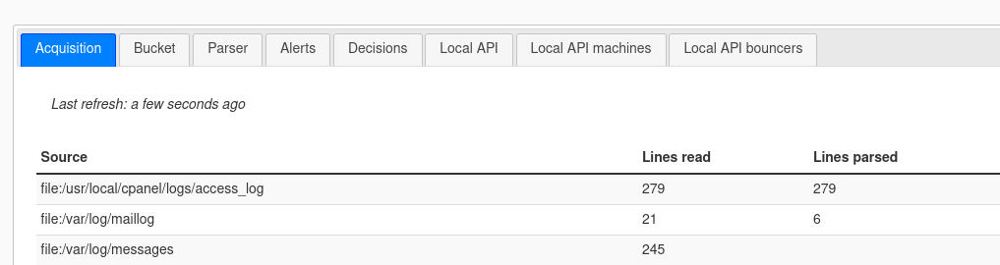
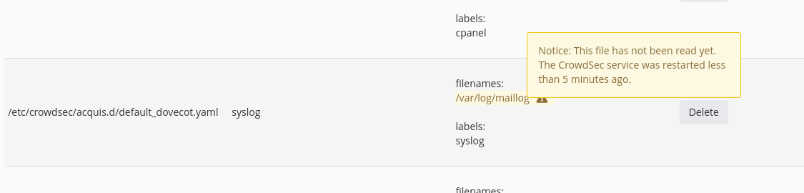
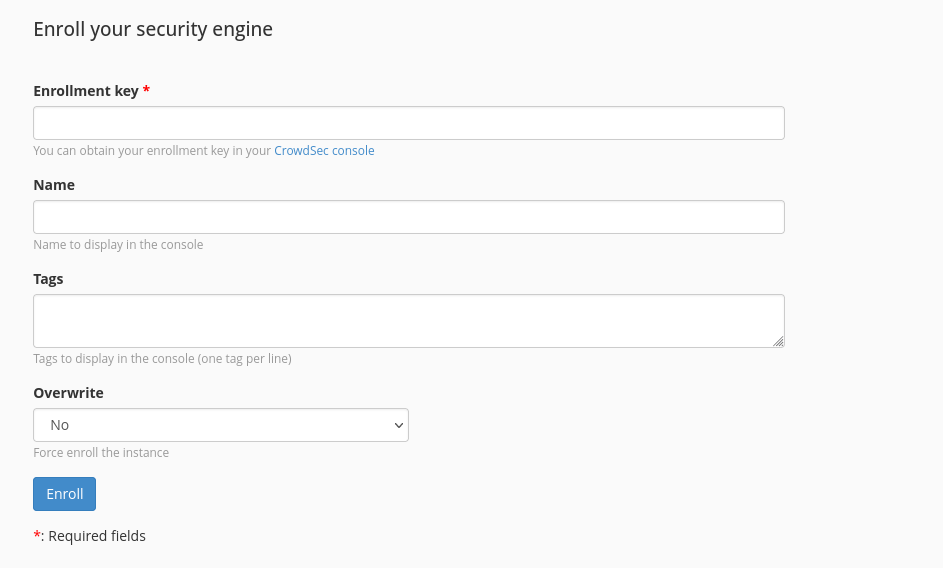
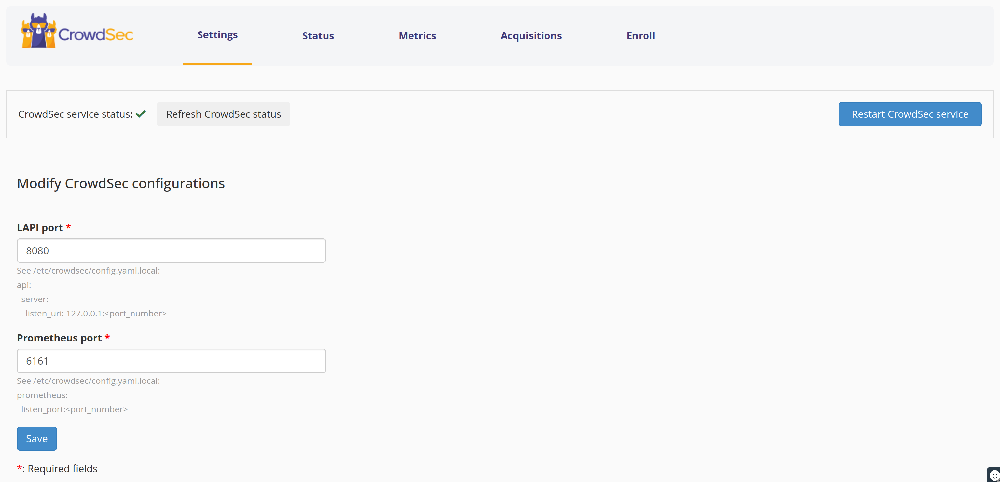

The WHM plugin offers a streamlined approach for controlling and monitoring the CrowdSec Security Engine protecting your server directly from your WHM dashboard.  
Designed specifically for WHM environments, this plugin comes packaged with configurations tailored to enhance your server's security posture efficiently.  

In a few easy steps, this guide walks you through the installation of the WHM plugin, and post-install verification that everything is working fine.

## Installation

### Prerequisites: install CrowdSec

To be able to use this plugin, the first step is to [install CrowdSec Security Engine](https://doc.crowdsec.net/docs/getting_started/install_crowdsec) on your WHM server.

### Download the plugin

First, connect to your WHM server.

Go to your home directory or any directory that can be used to download the sources.

Choose [the release X.Y.Z you want to install](https://github.com/crowdsecurity/cs-whm-plugin/releases),
and:

* Download the source code archive.


```shell
wget https://github.com/crowdsecurity/cs-whm-plugin/archive/refs/tags/vX.Y.Z.tar.gz
```

* Extract sources:

```shell
tar -xvf vX.Y.Z.tar.gz
``` 

* Go to the extracted folder:

```shell
cd cs-whm-plugin-X.Y.Z/plugin
``` 


### Install the plugin

Once you've retrieved the sources, you can install the plugin by running the `install` script as root:

```shell
sudo sh crowdsec.sh install
```

You should see:

```
Installing CrowdSec plugin...
crowdsec registered
```

If you've already installed CrowdSec, the script will also use the `cscli` command to install the WHM collection, create a few acquisition files and restart the CrowdSec service.

If you don't want the script to install the WHM collection, you can use the `--only-plugin` option:

```
sudo sh crowdsec.sh install --only-plugin
```


### Navigate to the plugin in WHM


CrowdSec should appear in the sidebar in the **Plugins** section.  
Easily find it by filtering your sidebar by starting to type ***"crowdsec"***


## Post-installation checks

Once installation is complete, you can perform a few post-installation tasks to ensure that everything works as expected.


### Check the CrowdSec service status

At the top of all CrowdSec plugin pages, you can see the status of the CrowdSec service: if there's a green tick, the service is running. 



If not, [check the troubleshooting section](#crowdsec-is-not-running).

### Check the metrics

Browse to the metrics tab and ensure that The CrowdSec security engine 



If not, [check the troubleshooting section](#changing-port-configuration).

### Check the default acquisition files

The plugin comes with a set of default acquisition configuration files tailored for WHM typical logs directories.  
Those files are created in `etc/crowdsec/acquis.d/`, each file allows reading the logs for the various services you want to protect. 
Note that the main acquisition file is `/etc/crowdsec/acquis.yaml`, but all additional acquisitions should be placed in `/etc/crowdsec/acquis.d`.  

The **acquisition tab** of the plugin will list the various acquisition configuration files and a summary of their contents.
This section is for a somewhat advanced usage of CrowdSec. If you installed WHM with the default configuration the default acquisitions should be sufficient.

What is being parsed can be seen in the **metrics tab** of the plugin.  
The principal thing you should be concerned about is that your web server logs are properly parsed which for the default cases means that the apache2 logs are properly read.

Some acquisitions may display a warning (⚠)sign next to the "logs filenames" that indicates that "nothing was parsed from that path" since the last CrowdSec service restart.  
Depending on the activity on your server it might be normal, you can check the lines parsed in the **metrics > acquisition** section.  
Usually, you should see activity within a few minutes.



### Enroll your engine in CrowdSec's Console

CrowdSec's console can provide additional insights into what's happening on your park of security engines, along with additinonal features allowing you, among other things, to feed your security engine additional blocklists to protect your perimeter (if you want for example to block botnets of tor nodes from accessing your server).  
The Console is available on [app.crowdsec.net](https://app.crowdsec.net/)

You can enroll your engine by going to the Enroll tab.
Fill in your enrollment key and click the `Enroll` button.



You'll see A confirmation of enrollment in your console and upon acceptance, you'll see your instance in the console


For the benefits, please visit the [Console section](https://docs.crowdsec.net/docs/next/console/intro)

## Troubleshoot

### CrowdSec is not running

Most of the time it will be a port conflict or config file error
- Check and change the ports [In the settings menu](#changing-port-configuration).
- Check the logs for error
  - In CrowdSec's logs sudo less /var/log/crowdsec.log: Note that it might be very verbose.
  - You can also check:  sudo journalctl -u crowdsec
- Ultimately, you can check the [Security Engine Troubleshooting section](/u/troubleshooting/security_engine/)

### Changing port configuration

Note that CrowdSec security engine local API uses the 8080 port by default. And the metrics service (Prometheus) uses 6060.  
It might be conflicting with another service installed on your server.  
You may have port conflict on either the CrowdSec Security Engine local API port or the metric (Prometheus) port.  

Easily change them and restart the service from the **Settings** menu of the plugin.

